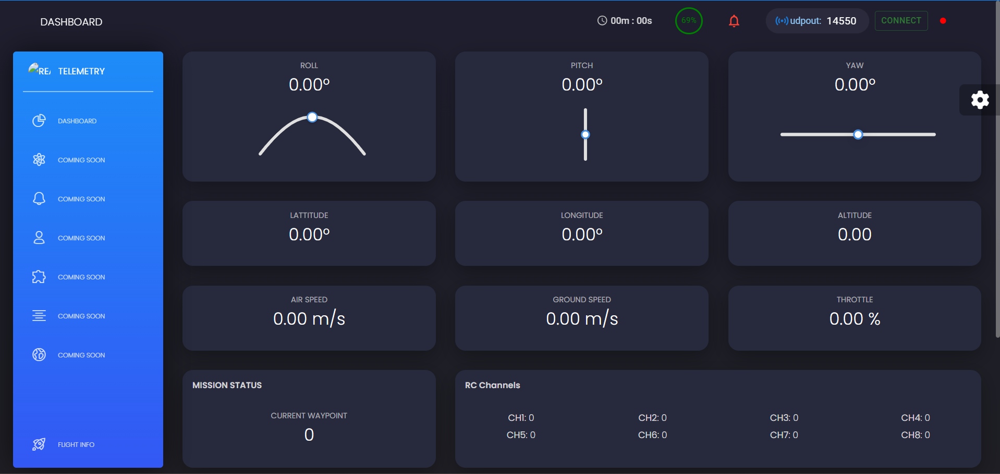
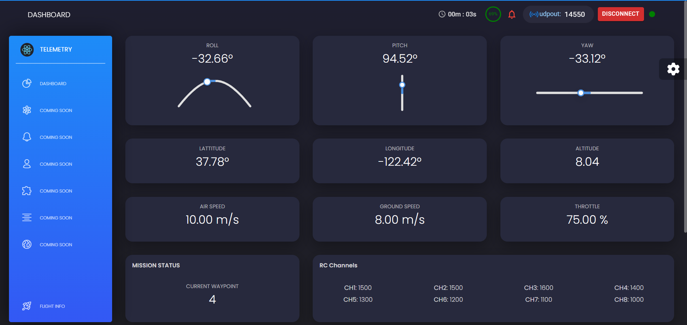

# Customized Dashboard to visualize MAVProxy Telemetry data
  Tech Stack : Python, REACT, pymavlink, MAVProxy
  
  React-based Dashboard, python-pymavlink telemetry simulator for testing, python and Socket.IO for real-time data relay.

  ## Installation/Usage

Install all the required Dependencies

1) In one of the terminal
```python
python simulate_mavlink_v2.py
```

2) In another terminal
```python
python async.py
```

3) In another terminal
Location : In frontend folder
```python
npm install
npm start
```

  ## Preview




